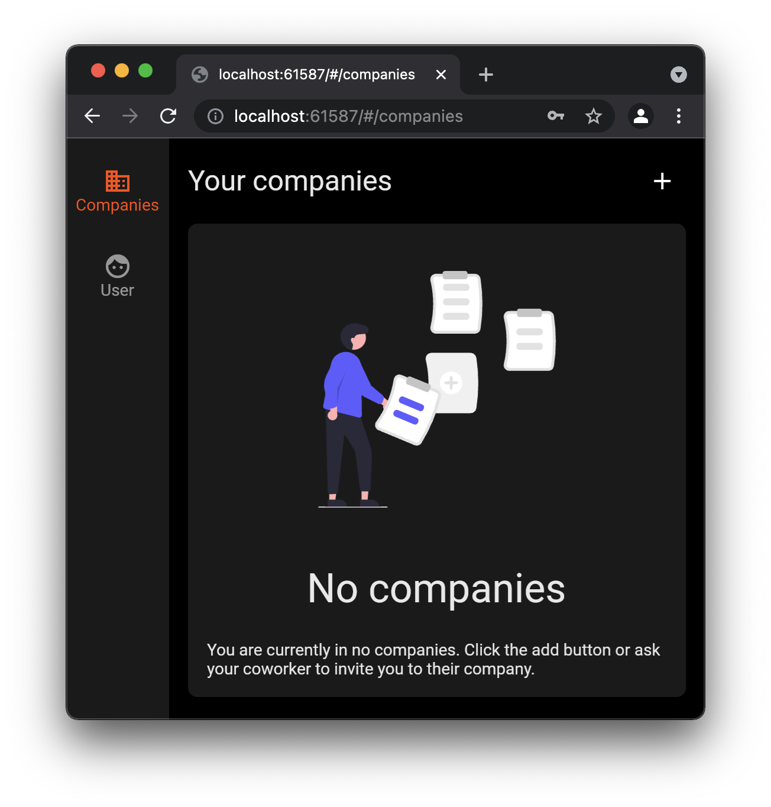
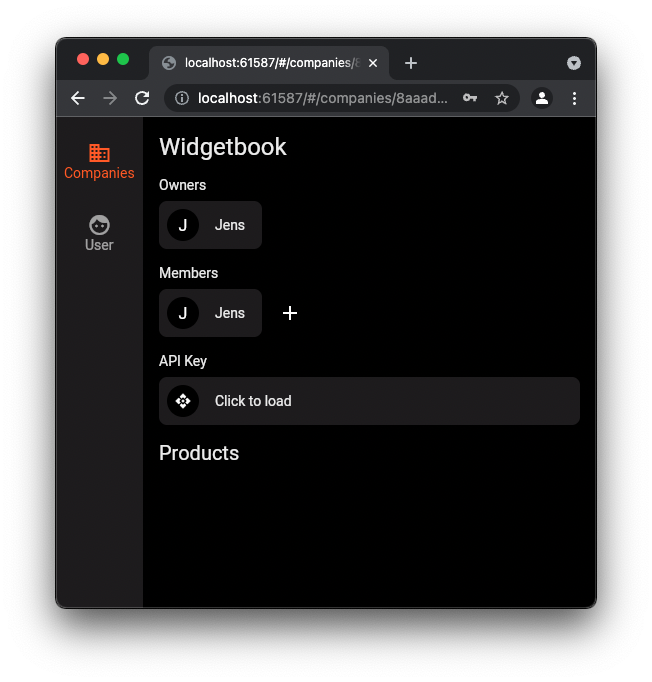
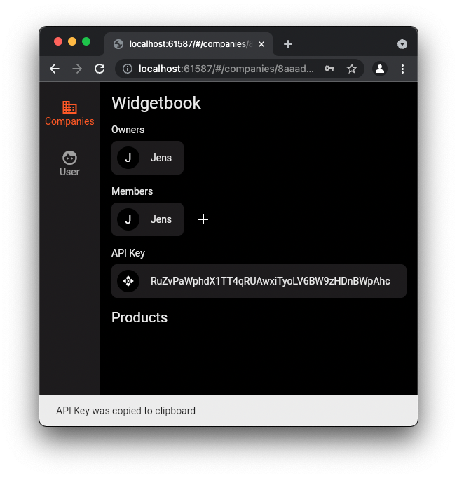

# Widgetbook Hosting

The Widgetbook Hosting GitHub action allows users to upload the Flutter web version of a Widgetbook to the collaboration platform. 

# Setup 

Before the web version of your Widgetbook can be uploaded to the collaboration platform, you need to build the web app first. You know best how to build your app but your build action might look like this:

```yaml
name: Build 
on: [push]
jobs:
  build:
    runs-on: ubuntu-latest
    steps:
      - name: Checkout
        uses: actions/checkout@v2

      - name: Setup flutter
        uses: subosito/flutter-action@v1
        with:
          channel: stable

      - name: Build Website
        run: flutter build web -t path/to/main.widgetbook.dart
```

By running this script, a folder structure `./build/web/` with the widgetbook web app will be created. The output folder of the build is required by the Widgetbook Hosting action and will be uploaded to the collaboration platform.

## Inputs

The action defines the following inputs

### `path`

**Optional** The path to the web build of the widgetbook.

**Default** `build/web`

### `api_key`

**Required** The API key for your company.

See how to create an API key for more information.

## How to create an API key

To create an API key, you need to login with your account at [app.widgetbook.io](https://app.widgetbook.io). API keys are bound to companies. Therefore, you require a company to retrieve an API key. Furthermore, only users with the `Company Owner` role can fetch the API keys of a company. 

> **Alpha Version:** For now, the only way to become a `Company Owner` is to create a new company.

As a user you can create a new company by clicking the add button. 



> **Alpha Version:** After the company is created, you need to logout and then login again. After you logged in again, you can view the details of the company.

On the detail page of a company, a card which allows to fetch the API key is displayed. 



Click the card to fetch the API key. The key will be copied to your clipboard.



# Example Usage 

```yaml
name: Build 
on: [push]
jobs:
  build:
    runs-on: ubuntu-latest
    steps:
      - name: Checkout
        uses: actions/checkout@v2

      - name: Setup flutter
        uses: subosito/flutter-action@v1
        with:
          channel: stable

      - name: Build Website
        run: flutter build web -t path/to/main.widgetbook.dart

      - name: Upload Widgetbook
        uses: widgetbook/widgetbook-hosting@0.0.10
        with:
          path: 'build/web'
          api_key: '<your API key>'
```
